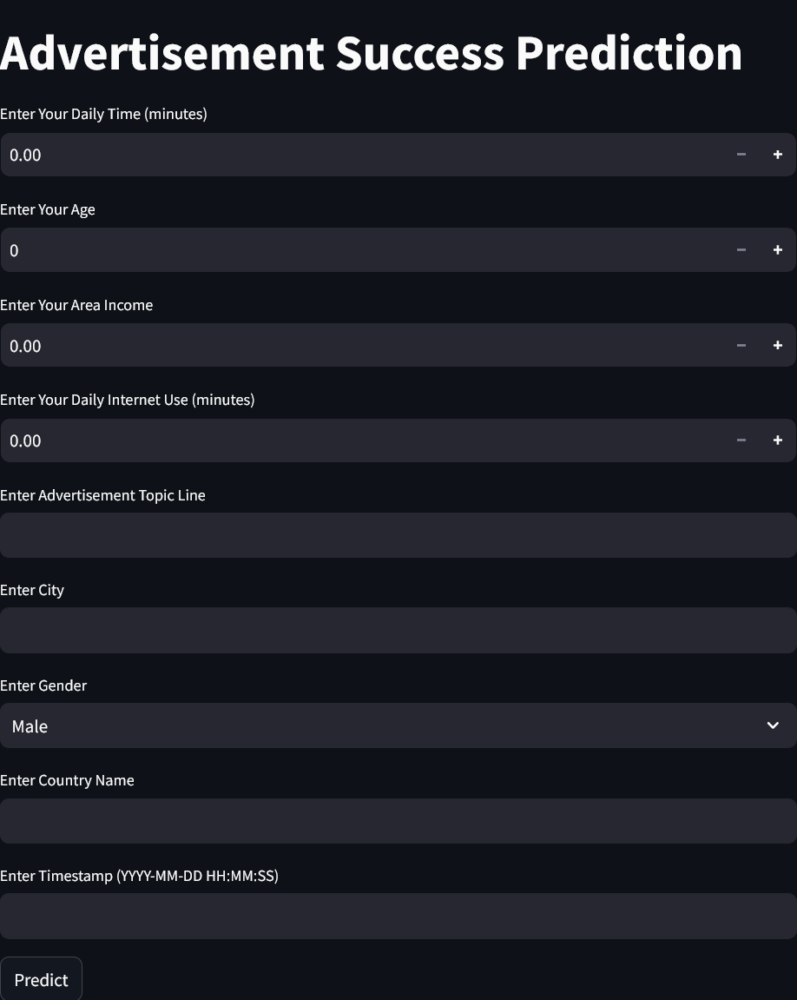

# AdSight: Predictive Ad Engagement Analyzer




## Project Overview

AdSight (formerly AdView Pro) is a machine learning project that predicts whether a user is likely to engage with an advertisement based on various factors. This project leverages IBM Watson for model training and deployment, and uses Streamlit for creating a user-friendly web interface. The final application is deployed on Heroku.

This project was inspired by and built upon the work of others in the field of advertisement prediction and machine learning deployment.

## Table of Contents

1. [Project Setup](#project-setup)
2. [Dataset](#dataset)
3. [IBM Watson Setup](#ibm-watson-setup)
4. [Model Training and Deployment](#model-training-and-deployment)
5. [Streamlit Application](#streamlit-application)
6. [Heroku Deployment](#heroku-deployment)
7. [File Structure](#file-structure)
8. [Usage](#usage)
9. [Maintenance](#maintenance)

## Project Setup

To set up this project, you'll need:

- An IBM Cloud account
- A Heroku account
- Python installed on your local machine
- Git for version control

## Dataset

The dataset used for this project is the "advertising.csv" file, which can be downloaded from [Kaggle](https://www.kaggle.com/fayomi/advertising). You'll need to download this file and include it in your project directory.

### Attributes in the dataset

This data set contains the following features:

- **'Daily Time Spent on Site'**: consumer time on site in minutes
- **'Age'**: customer age in years
- **'Area Income'**: Avg. Income of geographical area of consumer
- **'Daily Internet Usage'**: Avg. minutes a day consumer is on the internet
- **'Ad Topic Line'**: Headline of the advertisement
- **'City'**: City of consumer
- **'Male'**: Whether or not consumer was male
- **'Country'**: Country of consumer
- **'Timestamp'**: Time at which consumer clicked on Ad or closed window
- **'Clicked on Ad'**: 0 or 1 indicated clicking on Ad

## IBM Watson Setup

1. Log in to your IBM Cloud account.
2. Create a new Watson Studio service.
3. Create a new project in Watson Studio.
4. Upload your dataset (advertising.csv) to the project.

## Model Training and Deployment

1. In Watson Studio, create a new Auto AI experiment.
2. Select the target variable (Clicked on Ad) and features for prediction.
3. Run the experiment to train multiple models.
4. Compare model performances and select the best model.
5. Deploy the selected model as a web service.
6. Note down the API endpoint and credentials for later use.

## Streamlit Application

The Streamlit application is defined in `app.py`. Here's a breakdown of its key components:

1. Import required libraries:
   ```python
   import streamlit as st
   import requests
   ```

2. Set up the IBM Watson API connection:
   ```python
   API_KEY = "<Enter your API Key>"
   API_ENDPOINT = "https://eu-de.ml.cloud.ibm.com/ml/v4/deployments/xxxx"
   IAM_URL = "https://iam.cloud.ibm.com/identity/token"
   ```

   **Important:** Replace `"<Enter your API Key>"` with your actual IBM Watson API key. Also, replace the `API_ENDPOINT` with the specific endpoint URL provided by IBM Watson after you've trained and deployed your model. The URL should look similar to the example above, but with your unique deployment ID instead of "xxxx".

3. Functions for token retrieval and prediction:
   ```python
   def get_ibm_token(api_key: str) -> str:
       # ... (token retrieval logic)

   def predict_ad_view(input_features: list, token: str) -> float:
       # ... (prediction logic)
   ```

4. Streamlit interface and prediction:
   ```python
   def main():
       st.title('AdSight: Predictive Ad Engagement Analyzer')
       # ... (input fields)
       if st.button('Predict'):
           # ... (prediction and result display)
   ```

## Heroku Deployment

To deploy the Streamlit app on Heroku, you'll need three additional files:

1. `Procfile`:
   ```
   web: sh setup.sh && streamlit run app.py
   ```

2. `requirements.txt`:
   ```
   streamlit
   requests
   ```

3. `setup.sh`:
   ```bash
   mkdir -p ~/.streamlit/
   echo "[server]
   port = $PORT
   enableCORS = false
   headless = true
   " > ~/.streamlit/config.toml
   ```

To deploy:

1. Initialize a Git repository in your project folder.
2. Create a new Heroku app: `heroku create your-app-name`
3. Push your code to Heroku: `git push heroku master`

## File Structure

Your project should have the following file structure:

```
adsight/
├── advertising.csv
├── app.py
├── Procfile
├── requirements.txt
├── setup.sh
└── README.md
```

Note: The `advertising.csv` file should be downloaded from the Kaggle link provided in the Dataset section.

## Usage

Users can interact with the deployed application by:

1. Entering their demographic information (age, gender, location).
2. Providing usage data (daily internet use, area income).
3. Entering advertisement details (topic line, timestamp).
4. Clicking the "Predict" button to see if they're likely to engage with the ad.

## Maintenance

- Regularly update the IBM Watson API key and endpoint if needed.
- Monitor the application's performance and retrain the model periodically.

---

This project demonstrates the power of combining IBM Watson's machine learning capabilities with Streamlit's user-friendly interface creation, all deployed on Heroku for easy access. It serves as an excellent example of end-to-end machine learning project deployment in a cloud environment.

Remember to replace `"<Enter your API Key>"` and update the `API_ENDPOINT` in `app.py` with your actual IBM Watson API key and deployment URL before deploying.

